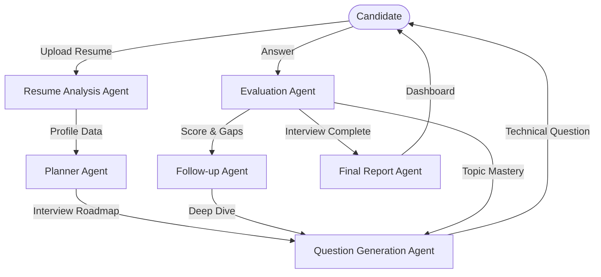

# 🤖 AI Interview Copilot

AI Interview Copilot is a state-of-the-art, agentic AI platform designed to simulate realistic, technical interview experiences. It analyzes resumes, generates tailored interview plans, conducts adaptive questioning sessions, and provides comprehensive feedback reports—all powered by a multi-agent orchestration layer.

---

## 🏗️ Agentic AI Architectural Flow

The core of this project is built on a **Multi-Agent Orchestration** design. Instead of a single linear prompt, the system breaks down the interview process into specialized roles, each handled by a dedicated AI agent.



### 🤝 Meet the Agents
1.  **Resume Analysis Agent**: Parses complex PDF/Text resumes to extract technical stacks, project depths, and career progression.
2.  **Planner Agent**: Generates a structured roadmap of interview topics (e.g., System Design, Coding, Behavioral) customized to the candidate's profile.
3.  **Question Generation Agent**: Crafts context-aware technical questions that evolve based on previous responses.
4.  **Evaluation Agent**: Analyzes answers for technical accuracy, communication clarity, and completeness.
5.  **Follow-up Agent**: Identified as the "Deep Diver," this agent triggers follow-up questions when a candidate provides a shallow or slightly incorrect answer.
6.  **Report Agent**: Aggregates all session data into a professional performance report with actionable insights.

---

## 🛠️ Tech Stack

### Frontend
- **Framework**: [Next.js 15](https://nextjs.org/) (App Router)
- **Styling**: [Tailwind CSS](https://tailwindcss.com/)
- **UI Components**: [shadcn/ui](https://ui.shadcn.com/) & [Lucide React](https://lucide.dev/)
- **State Management & API**: Axios & React Hooks
- **Animations**: [Framer Motion](https://www.framer.com/motion/) / Tailwind Animate

### Backend
- **API Framework**: [FastAPI](https://fastapi.tiangolo.com/)
- **AI Orchestration**: [LangChain](https://www.langchain.com/) & [LangGraph](https://www.langchain.com/langgraph)
- **LLM Provider**: [Groq](https://groq.com/) (Llama 3 / Mixtral)
- **Vector Search & RAG**: [Sentence-Transformers](https://sbert.net/) & [LangChain Text Splitters](https://python.langchain.com/docs/modules/data_connection/document_transformers/)
- **Document Processing**: PyPDF
- **Environment**: Python 3.10+

---

## 🚀 How It Works

1.  **Resume Ingestion**: The user uploads their resume. The backend utilizes `PyPDF` and `RecursiveCharacterTextSplitter` to process the text.
2.  **Dynamic Profiling**: The `Resume Agent` builds a high-dimensional profile of the candidate's strengths.
3.  **Interview Loop**:
    - The system picks a topic from the `Interview Plan`.
    - `Question Agent` serves a question.
    - User submits an answer via the frontend.
    - `Evaluation Agent` scores the response.
    - If the score is below a threshold, the `Follow-up Agent` asks a clarifying question to give the candidate a second chance.
4.  **Final Report**: Once all topics are exhausted, the `Report Agent` summarizes the session, highlighting "Top Strengths" and "Areas for Improvement."

---

## ⚙️ Getting Started

### Prerequisites
- Node.js (v18+)
- Python (v3.10+)
- Groq API Key

### Installation

1.  **Clone the repository**:
    ```bash
    git clone https://github.com/your-repo/ai-interview-copilot.git
    cd ai-interview-copilot
    ```

2.  **Backend Setup**:
    ```bash
    cd backend
    python -m venv venv
    source venv/bin/activate  # On Windows: venv\Scripts\activate
    pip install -r requirements.txt
    ```
    Create a `.env` file in the `backend` directory:
    ```env
    GROQ_API_KEY=your_key_here
    ```

3.  **Frontend Setup**:
    ```bash
    cd ../frontend
    npm install
    npm run dev
    ```

4.  **Run the Backend**:
    ```bash
    cd ../backend
    uvicorn main:app --reload
    ```

---

## ✨ Features
- 📄 **Resume Intelligence**: Deep parsing of PDF resumes.
- 🔄 **Adaptive Questioning**: Real-time follow-ups based on answer quality.
- 📊 **Instant Evaluation**: Get scored on every response.
- 📱 **Premium UI**: Clean, modern interface built with shadcn/ui.
- ⚡ **High Performance**: Backend powered by Groq's LPU for near-instant AI responses.

---

*Made with ❤️ for developers by developers.*
